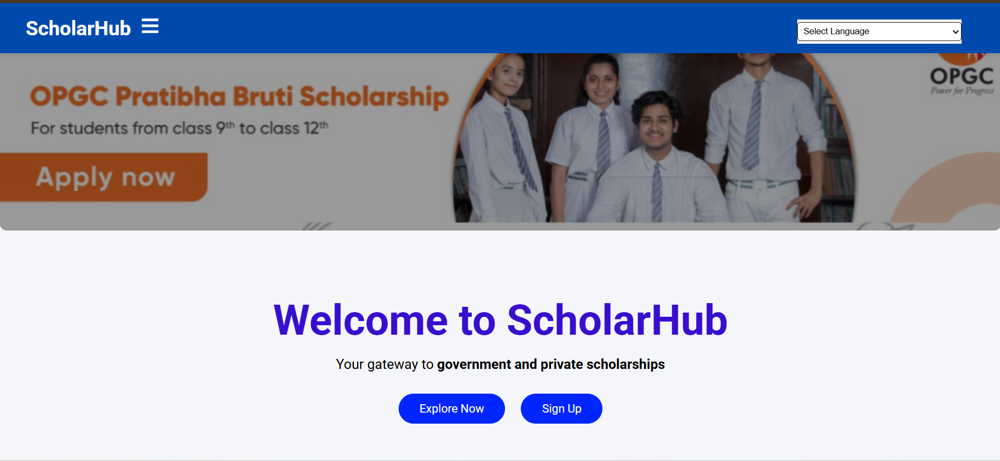
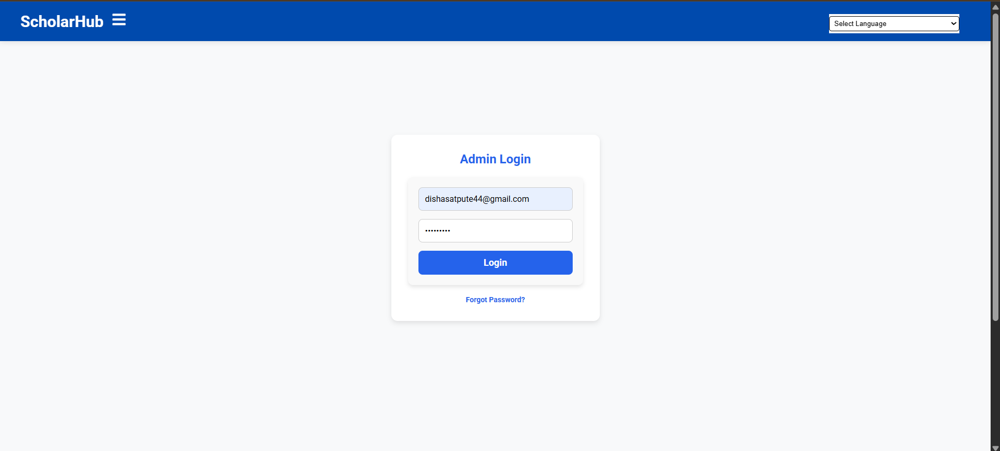
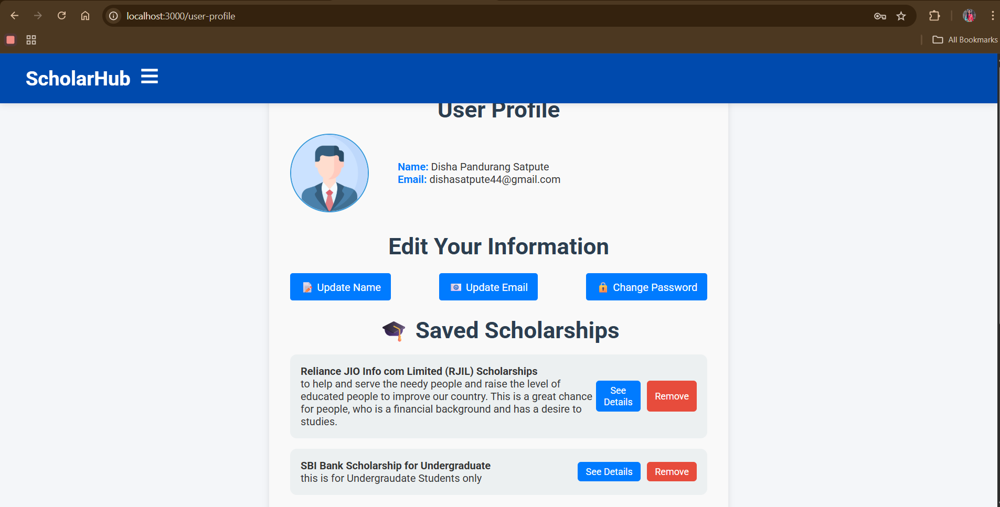
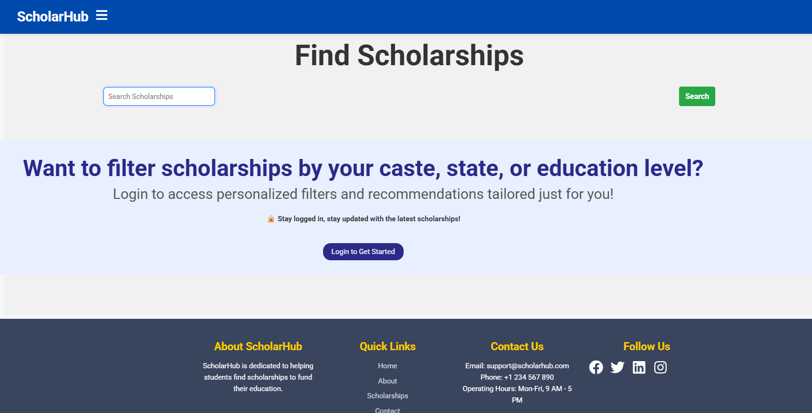
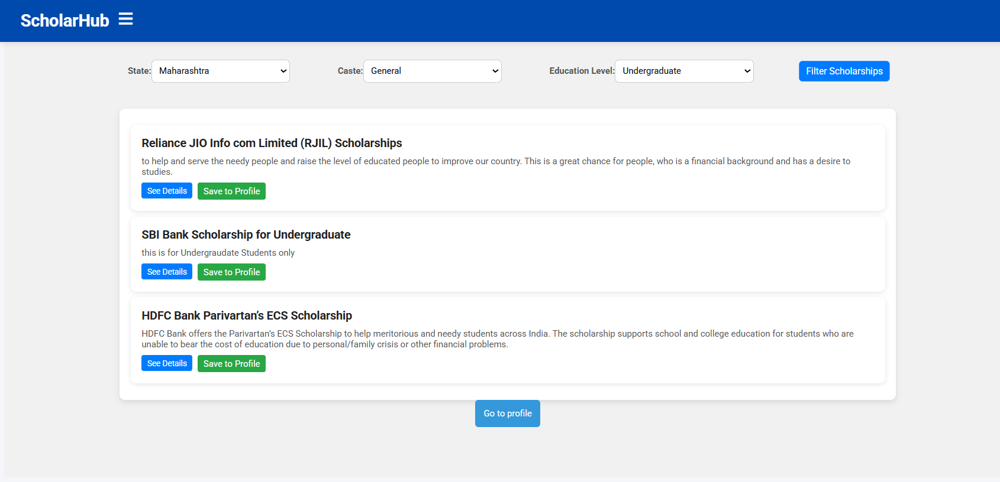
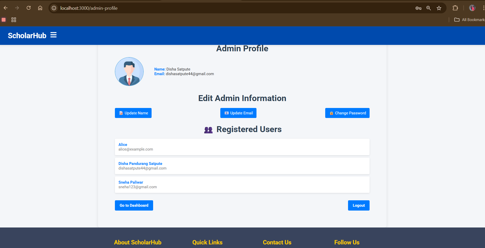
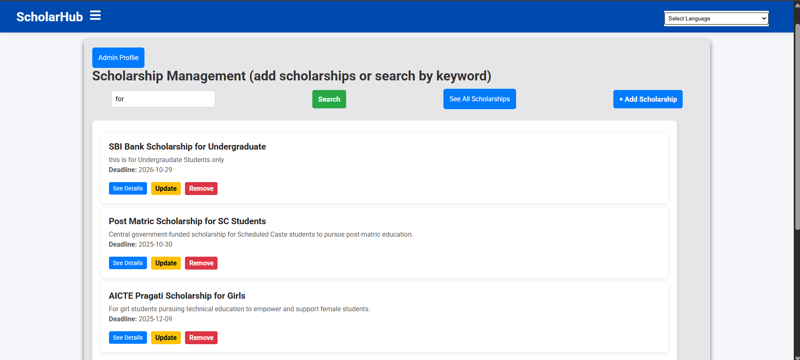
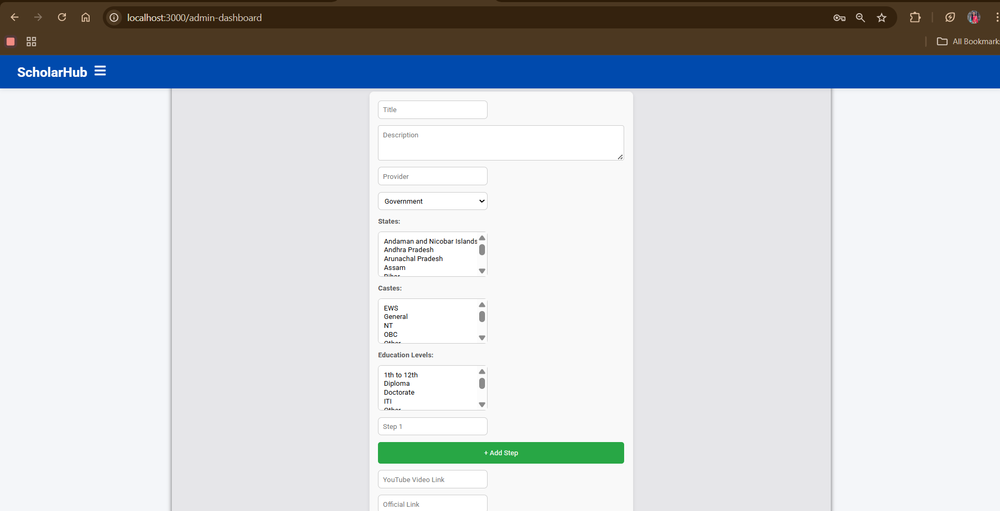

## 🎯B.Tech Second Year Minor Project 

### Title: ScholarHub – Student Scholarship Discovery & Management System

----------------------------------------------------------------------------------------------------------------------------------------

📄PROBLEM STATEMENT -
-
To develop a full-stack web application that allows students to discover, filter, save, and apply for scholarships based on various criteria, while enabling admins to manage Scholarships and users.

🧑‍💻 TECHNOLOGY USED -
-
- Frontend: React.js
- Backend: Node.js + Express.js
- Database: PostgreSQL
- Authentication: JWT
- Styling: HTML, CSS, Bootstrap 
- State Management: React Hooks
- Other Tools: VS Code, Postman

🎯 OBJECTIVES -
-
- To make scholarship discovery easy, personalized, and accessible to students.
- To allow filtered search based on state, caste, and education level.
- To enable users to save scholarships to their profile for later access.
- To give admins control over managing scholarships, users.
- To integrate a dynamic, profile-based UI for better engagement.

✅ CONCLUSION -
-
ScholarHub addresses a major gap in centralized scholarship discovery. With an intuitive UI, smart filters and give information about all types of scholarships(Government,Private,NGO-based,Fellowships) it empowers students to make informed decisions and allows organization to promote transparency. It can significantly enhance awareness and access to financial aid.

📈 ScholarHub Workflow Diagram -
-

🌟 Want to understand how ScholarHub works behind the scenes?
Check out the full **System Workflow Diagram** below:

➡️ [🚀 Click to Open Diagram](https://gitdiagram.com/disha-satpute/scholarhub)


🖼️ Website Screenshots -
-
#### 🔎 Home page


#### 👩🏼‍💻 Login page


#### 👤 User Profile Page


#### 🧾 Scholarship Details Page


#### 📋 keyword Search


#### 📋 Filtered Search


#### 👤 Admin Profile


#### 👤 Admin Dashboard


#### 🌟 Add Scholarship


------------------------------------------------------------------------------------------------------------------------
☑️INSTALLATION -
-
- Just, Clone this repository : 
````bash 
git clone https://github.com/disha-satpute/scholarhub.git
````

- Navigate into the project :
````bash 
cd scholarhub
````

- Install server dependencies :
````bash 
cd server
npm install
````

- Install client dependencies:
````bash 
cd ../client
npm install
````

- Set up environment variables:
In /server, create .env:
````bash 
PORT=5000
DB_URL=your_postgres_db_url
JWT_SECRET=your_jwt_secret
````

Run backend and frontend:
````bash 
# In /server
node server.js

# In /client
npm start
````


